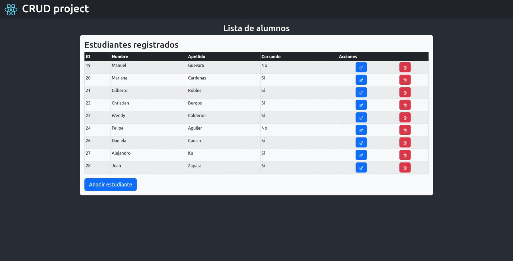
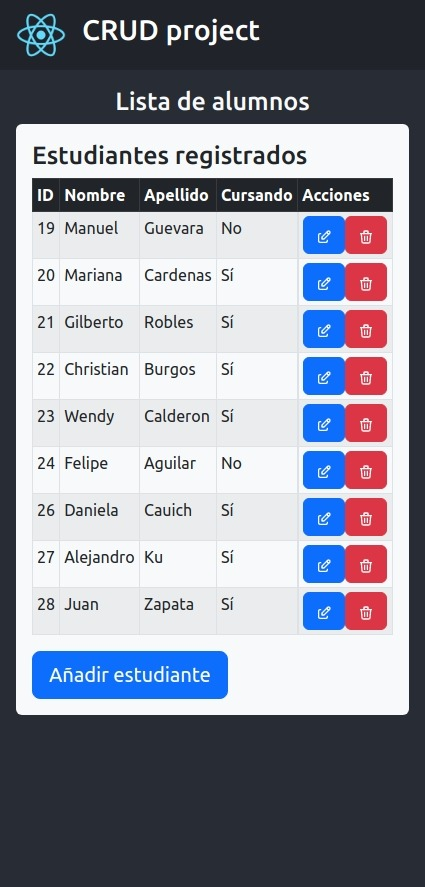

# (CRUD) Student regitration - React

This is the front-end build of Student registration CRUD, the project register, modify, and delete data from students in de DB

## The challenge ✅

Users should be able to:

- View the optimal layout for the site depending on their device's screen size
- Register a new student
- Modify data of students
- Delete students
- View student list

## Screenshots 📸

- ### 🖥️ Desktop version
  
- ### 📱 Mobile version
  

## Links 🔗

- Repo: [Github](https://github.com/RicAlc/students-crud-react)
- Site URL: in progress
- Full CRUD project repo: [Github](https://github.com/RicAlc/students-crud)

## Built with 🧰 🛠️

- React
- Sass
- Bootstrap
- Reactstrap
- React icons
- React router
- Axios
- Saas

## Author 🧑🏽‍💻

- Github - [Ricardo Alcalá](https://www.github.com/RicAlc)
- Twitter - [@\_RicAlc](https://twitter.com/_RicAlc)
